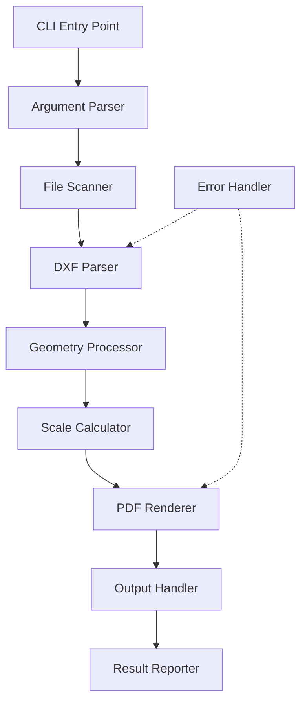

# Design Document: DXF to PDF Printer

## Overview

The DXF to PDF Printer is a command-line tool built with Python that converts DXF (Drawing Exchange Format) files into A4 landscape PDF documents. The tool uses `ezdxf` for DXF parsing and `matplotlib` with `reportlab` for PDF generation with precise page sizing.

### Technology Stack

- **Language**: Python 3.8+
- **DXF Parsing**: ezdxf
- **PDF Generation**: reportlab
- **Rendering**: matplotlib (for geometry visualization)
- **CLI Framework**: argparse (built-in)
- **File Operations**: pathlib (built-in)

### Design Rationale

- **ezdxf**: Comprehensive DXF parsing library with support for all DXF versions and entity types
- **reportlab**: Professional PDF generation with precise control over page size and orientation
- **matplotlib**: Provides geometry rendering capabilities that can be exported to PDF
- **Python**: Cross-platform, excellent CAD file handling libraries

## Architecture



### Component Flow

1. **CLI Entry Point**: Receives user command and arguments
2. **Argument Parser**: Validates input file/directory and output paths
3. **File Scanner**: Discovers DXF files (single file or batch)
4. **DXF Parser**: Reads and parses DXF file structure
5. **Geometry Processor**: Extracts drawing entities and calculates bounding box
6. **Scale Calculator**: Computes scale factor to fit drawing on A4 landscape
7. **PDF Renderer**: Renders geometry to PDF with proper scaling
8. **Output Handler**: Saves PDF to specified location
9. **Result Reporter**: Displays conversion summary

## Components and Interfaces

### 1. CLI Module (`cli.py`)

**Responsibility**: Parse command-line arguments and orchestrate conversion

```python
def main():
    """Entry point for the CLI application"""
    
def parse_arguments() -> argparse.Namespace:
    """Parse and validate command-line arguments"""
    # Returns: Namespace with input_path, output_dir, output_file
```

**Arguments**:
- `input`: Input DXF file or directory path (required)
- `--output-dir` / `-d`: Output directory for PDFs (default: same as input)
- `--output` / `-o`: Output PDF filename for single file conversion (optional)

### 2. File Scanner Module (`scanner.py`)

**Responsibility**: Discover DXF files from input path

```python
def scan_dxf_files(input_path: Path) -> List[Path]:
    """
    Scan for DXF files from file or directory path
    
    Args:
        input_path: Path to DXF file or directory
        
    Returns:
        List of Path objects for .dxf files
    """
```

### 3. DXF Parser Module (`parser.py`)

**Responsibility**: Parse DXF files and extract drawing data

```python
class DXFParser:
    def parse_file(self, dxf_path: Path) -> ezdxf.document.Drawing:
        """
        Parse DXF file and return drawing document
        
        Args:
            dxf_path: Path to DXF file
            
        Returns:
            ezdxf Drawing object
            
        Raises:
            DXFParseError: If file cannot be parsed
        """
```

### 4. Geometry Processor Module (`geometry.py`)

**Responsibility**: Extract entities and calculate bounding box

```python
class GeometryProcessor:
    def extract_entities(self, drawing: ezdxf.document.Drawing) -> List[Any]:
        """Extract all drawable entities from DXF drawing"""
        
    def calculate_bounding_box(self, entities: List[Any]) -> Tuple[float, float, float, float]:
        """
        Calculate bounding box of all entities
        
        Returns:
            Tuple of (min_x, min_y, max_x, max_y)
        """
```

### 5. Scale Calculator Module (`scale.py`)

**Responsibility**: Calculate scale factor and positioning for A4 landscape

```python
class ScaleCalculator:
    A4_WIDTH_MM = 297
    A4_HEIGHT_MM = 210
    MARGIN_MM = 10
    
    def calculate_scale(self, bbox: Tuple[float, float, float, float]) -> float:
        """
        Calculate scale factor to fit drawing on A4 landscape
        
        Args:
            bbox: Bounding box (min_x, min_y, max_x, max_y)
            
        Returns:
            Scale factor to apply to drawing
        """
        
    def calculate_offset(self, bbox: Tuple[float, float, float, float], scale: float) -> Tuple[float, float]:
        """
        Calculate offset to center drawing on page
        
        Returns:
            Tuple of (offset_x, offset_y) in mm
        """
```

### 6. PDF Renderer Module (`renderer.py`)

**Responsibility**: Render DXF geometry to PDF

```python
class PDFRenderer:
    def __init__(self, page_size: Tuple[float, float] = (297, 210)):
        """Initialize renderer with A4 landscape page size in mm"""
        
    def render_to_pdf(
        self,
        entities: List[Any],
        output_path: Path,
        scale: float,
        offset: Tuple[float, float]
    ) -> bool:
        """
        Render DXF entities to PDF file
        
        Args:
            entities: List of DXF entities to render
            output_path: Path for output PDF
            scale: Scale factor to apply
            offset: Offset for centering (x, y) in mm
            
        Returns:
            True if successful, False otherwise
        """
```

### 7. Result Reporter Module (`reporter.py`)

**Responsibility**: Display conversion results

```python
@dataclass
class ConversionResult:
    total_files: int
    successful: int
    failed: List[Tuple[Path, str]]
    output_files: List[Path]
    
def report_results(result: ConversionResult) -> None:
    """Display formatted conversion results to console"""
```

## Data Models

### ConversionResult

```python
@dataclass
class ConversionResult:
    """Results of DXF to PDF conversion operation"""
    total_files: int              # Total DXF files found
    successful: int               # Number of successful conversions
    failed: List[Tuple[Path, str]]  # Failed files with error messages
    output_files: List[Path]      # Paths to generated PDF files
```

### DrawingInfo

```python
@dataclass
class DrawingInfo:
    """Information about a DXF drawing"""
    entities: List[Any]           # DXF entities
    bounding_box: Tuple[float, float, float, float]  # min_x, min_y, max_x, max_y
    scale: float                  # Calculated scale factor
    offset: Tuple[float, float]   # Centering offset (x, y)
```

## Error Handling

### Error Categories

1. **File System Errors**
   - DXF file not found
   - Permission denied for reading DXF or writing PDF
   - Invalid directory path

2. **DXF Parsing Errors**
   - Corrupted DXF file
   - Unsupported DXF version
   - Invalid DXF structure

3. **Rendering Errors**
   - Empty drawing (no entities)
   - Unsupported entity types
   - PDF generation failures

### Error Handling Strategy

```python
# Individual file conversion errors are caught and logged
# Process continues with remaining files in batch mode
try:
    pdf_path = convert_dxf_to_pdf(dxf_file)
    successful_conversions.append(pdf_path)
except DXFParseError as e:
    failed_conversions.append((dxf_file, f"Parse error: {e}"))
    logger.error(f"Failed to parse {dxf_file}: {e}")
except RenderError as e:
    failed_conversions.append((dxf_file, f"Render error: {e}"))
    logger.error(f"Failed to render {dxf_file}: {e}")
```

### Logging

- Use Python's `logging` module
- Log levels:
  - INFO: File processing progress, successful operations
  - WARNING: Individual file conversion failures
  - ERROR: Critical failures
- Log format: `[TIMESTAMP] [LEVEL] [MODULE] Message`

## Testing Strategy

### Unit Tests

1. **File Scanner Tests**
   - Test single DXF file input
   - Test directory with multiple DXF files
   - Test empty directory handling

2. **DXF Parser Tests**
   - Test parsing valid DXF files
   - Test handling corrupted DXF files
   - Test different DXF versions

3. **Geometry Processor Tests**
   - Test bounding box calculation for various entity types
   - Test empty drawing handling

4. **Scale Calculator Tests**
   - Test scale calculation for drawings larger than page
   - Test scale calculation for drawings smaller than page
   - Test centering offset calculation

5. **PDF Renderer Tests**
   - Test PDF generation with various entity types
   - Test A4 landscape page size
   - Test output file creation

### Integration Tests

1. **End-to-End Conversion**
   - Convert sample DXF files to PDF
   - Verify PDF page size is A4 landscape
   - Verify output files are created

2. **Batch Processing**
   - Test directory with multiple DXF files
   - Verify all files are processed
   - Verify error handling for mixed valid/invalid files

## Implementation Notes

### Page Size Configuration

- A4 Landscape: 297mm x 210mm (11.69" x 8.27")
- Margins: 10mm on all sides
- Drawable area: 277mm x 190mm

### Coordinate System

- DXF uses arbitrary units (typically mm or inches)
- Convert to mm for PDF rendering
- Handle coordinate system transformations

### Entity Support

Priority entity types to support:
1. LINE
2. CIRCLE
3. ARC
4. POLYLINE
5. LWPOLYLINE
6. TEXT
7. MTEXT

### Dependencies Installation

```bash
# Python packages
pip install ezdxf reportlab matplotlib

# No system dependencies required
```

## Future Enhancements

- Support for custom page sizes (A3, A2, etc.)
- Portrait orientation option
- Color preservation from DXF layers
- Line weight/style support
- Multi-page output for large drawings
- Custom scale factor override
