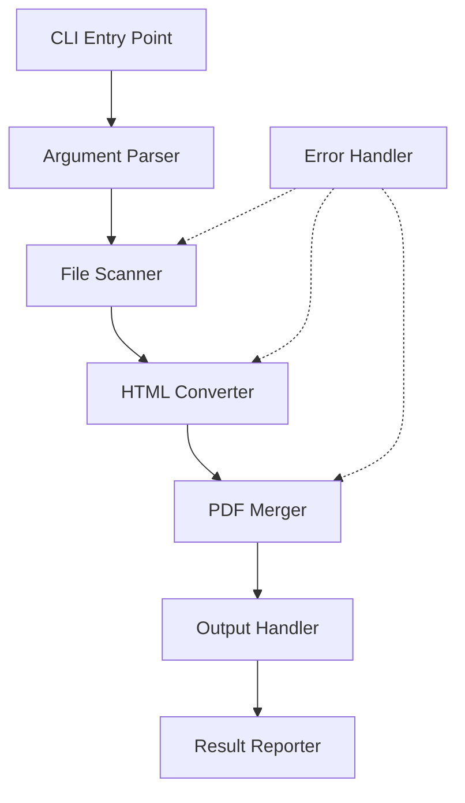

# Design Document: HTML to PDF Converter

## Overview

The HTML to PDF Converter is a command-line tool built with Python that converts multiple HTML files into individual PDFs and merges them into a single consolidated PDF document. The tool uses `pdfkit` (a Python wrapper for wkhtmltopdf) for HTML-to-PDF conversion and `PyPDF2` for PDF merging operations.

### Technology Stack

- **Language**: Python 3.8+
- **HTML to PDF Conversion**: pdfkit + wkhtmltopdf
- **PDF Merging**: PyPDF2
- **CLI Framework**: argparse (built-in)
- **File Operations**: pathlib (built-in)

### Design Rationale

- **pdfkit/wkhtmltopdf**: Provides high-quality HTML rendering with CSS support, widely used and reliable
- **PyPDF2**: Lightweight PDF manipulation library, suitable for merging operations
- **Python**: Cross-platform, excellent file handling, rich ecosystem for PDF operations

## Architecture



### Component Flow

1. **CLI Entry Point**: Receives user command and arguments
2. **Argument Parser**: Validates and processes input/output paths
3. **File Scanner**: Discovers and sorts HTML files
4. **HTML Converter**: Converts each HTML file to PDF
5. **PDF Merger**: Combines individual PDFs into single document
6. **Output Handler**: Saves final PDF to specified location
7. **Result Reporter**: Displays conversion summary
8. **Error Handler**: Manages exceptions throughout the pipeline

## Components and Interfaces

### 1. CLI Module (`cli.py`)

**Responsibility**: Parse command-line arguments and orchestrate the conversion process

```python
def main():
    """Entry point for the CLI application"""
    
def parse_arguments() -> argparse.Namespace:
    """Parse and validate command-line arguments"""
    # Returns: Namespace with source_dir, output_file
```

**Arguments**:
- `--source-dir` / `-s`: Source directory path (default: current directory)
- `--output` / `-o`: Output PDF file path (default: auto-generated with timestamp)

### 2. File Scanner Module (`scanner.py`)

**Responsibility**: Discover and sort HTML files in the source directory

```python
def scan_html_files(source_dir: Path) -> List[Path]:
    """
    Scan directory for HTML files and return sorted list
    
    Args:
        source_dir: Path to directory to scan
        
    Returns:
        List of Path objects for .html and .htm files, sorted alphabetically
    """
```

### 3. HTML Converter Module (`converter.py`)

**Responsibility**: Convert individual HTML files to PDF format

```python
class HTMLConverter:
    def __init__(self, temp_dir: Path):
        """Initialize converter with temporary directory for intermediate PDFs"""
        
    def convert_file(self, html_path: Path) -> Optional[Path]:
        """
        Convert single HTML file to PDF
        
        Args:
            html_path: Path to HTML file
            
        Returns:
            Path to generated PDF, or None if conversion failed
        """
        
    def convert_batch(self, html_files: List[Path]) -> Tuple[List[Path], List[Tuple[Path, str]]]:
        """
        Convert multiple HTML files to PDFs
        
        Args:
            html_files: List of HTML file paths
            
        Returns:
            Tuple of (successful_pdfs, failed_conversions)
            failed_conversions is list of (file_path, error_message) tuples
        """
```

### 4. PDF Merger Module (`merger.py`)

**Responsibility**: Combine multiple PDF files into a single document

```python
def merge_pdfs(pdf_files: List[Path], output_path: Path) -> bool:
    """
    Merge multiple PDF files into single output file
    
    Args:
        pdf_files: List of PDF file paths in desired order
        output_path: Path for output merged PDF
        
    Returns:
        True if merge successful, False otherwise
    """
```

### 5. Result Reporter Module (`reporter.py`)

**Responsibility**: Display conversion results and statistics

```python
class ConversionResult:
    """Data class for conversion results"""
    total_files: int
    successful: int
    failed: List[Tuple[Path, str]]
    output_path: Optional[Path]
    
def report_results(result: ConversionResult) -> None:
    """Display formatted conversion results to console"""
```

## Data Models

### ConversionResult

```python
@dataclass
class ConversionResult:
    """Results of HTML to PDF conversion operation"""
    total_files: int              # Total HTML files found
    successful: int               # Number of successful conversions
    failed: List[Tuple[Path, str]]  # Failed files with error messages
    output_path: Optional[Path]   # Path to final merged PDF (None if failed)
    processing_order: List[str]   # Ordered list of filenames processed
```

### Configuration

```python
@dataclass
class ConverterConfig:
    """Configuration for HTML to PDF converter"""
    source_dir: Path
    output_file: Path
    temp_dir: Path = Path(tempfile.gettempdir()) / "html2pdf_temp"
    wkhtmltopdf_options: Dict[str, Any] = field(default_factory=lambda: {
        'enable-local-file-access': None,
        'encoding': 'UTF-8',
    })
```

## Error Handling

### Error Categories

1. **File System Errors**
   - Source directory not found
   - Permission denied for reading HTML or writing PDF
   - Disk space issues

2. **Conversion Errors**
   - Malformed HTML
   - Missing resources (CSS, images)
   - wkhtmltopdf execution failures

3. **Merge Errors**
   - Corrupted intermediate PDFs
   - PyPDF2 merge failures

### Error Handling Strategy

```python
# Individual file conversion errors are caught and logged
# Process continues with remaining files
try:
    pdf_path = convert_html_to_pdf(html_file)
    successful_pdfs.append(pdf_path)
except ConversionError as e:
    failed_conversions.append((html_file, str(e)))
    logger.error(f"Failed to convert {html_file}: {e}")
    # Continue with next file

# Critical errors (no files converted, merge failure) stop execution
if not successful_pdfs:
    raise NoSuccessfulConversionsError("No HTML files were successfully converted")
```

### Logging

- Use Python's `logging` module
- Log levels:
  - INFO: File processing progress, successful operations
  - WARNING: Individual file conversion failures
  - ERROR: Critical failures that prevent output generation
- Log format: `[TIMESTAMP] [LEVEL] [MODULE] Message`

## Testing Strategy

### Unit Tests

1. **File Scanner Tests**
   - Test HTML file discovery with various extensions (.html, .htm)
   - Test alphabetical sorting
   - Test empty directory handling
   - Test directory with no HTML files

2. **HTML Converter Tests**
   - Test successful single file conversion
   - Test batch conversion with mixed success/failure
   - Test handling of malformed HTML
   - Test temporary file cleanup

3. **PDF Merger Tests**
   - Test merging 2+ PDFs
   - Test single PDF handling
   - Test output file creation
   - Test merge failure scenarios

4. **CLI Argument Parser Tests**
   - Test default values
   - Test custom source directory
   - Test custom output path
   - Test invalid arguments

### Integration Tests

1. **End-to-End Conversion**
   - Create test directory with sample HTML files
   - Run full conversion pipeline
   - Verify output PDF exists and contains expected pages
   - Verify page order matches alphabetical filename order

2. **Error Recovery**
   - Test with mix of valid and invalid HTML files
   - Verify partial success generates output
   - Verify error reporting is accurate

3. **File System Edge Cases**
   - Test with read-only directories
   - Test with very long filenames
   - Test with special characters in filenames

### Test Data

Create minimal HTML test files:
- `test_01.html`: Simple HTML with text
- `test_02.html`: HTML with CSS styling
- `test_03.html`: HTML with images (local references)
- `test_invalid.html`: Malformed HTML
- `test_empty.html`: Empty file

## Implementation Notes

### Temporary File Management

- Create temporary directory for intermediate PDFs
- Clean up temporary files after successful merge
- On error, optionally preserve temp files for debugging

### Output File Naming

Default output filename format: `combined_YYYYMMDD_HHMMSS.pdf`

Example: `combined_20251026_143022.pdf`

### Dependencies Installation

```bash
# Python packages
pip install pdfkit PyPDF2

# System dependency (wkhtmltopdf)
# Windows: Download installer from wkhtmltopdf.org
# Linux: sudo apt-get install wkhtmltopdf
# macOS: brew install wkhtmltopdf
```

### Cross-Platform Considerations

- Use `pathlib.Path` for all file operations (cross-platform)
- Handle wkhtmltopdf binary location differences across OS
- Test path separators and special characters on Windows

## Future Enhancements

Potential features for future iterations:
- Table of contents generation with clickable links
- Custom page ordering (not just alphabetical)
- Parallel conversion for improved performance
- Progress bar for large batches
- Configuration file support for conversion options
- Recursive directory scanning option
